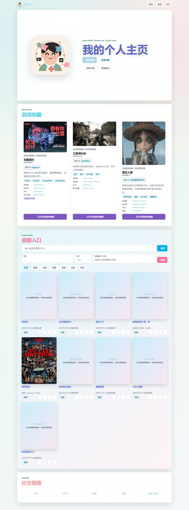
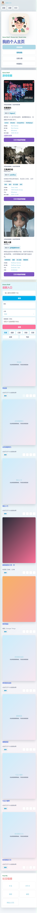
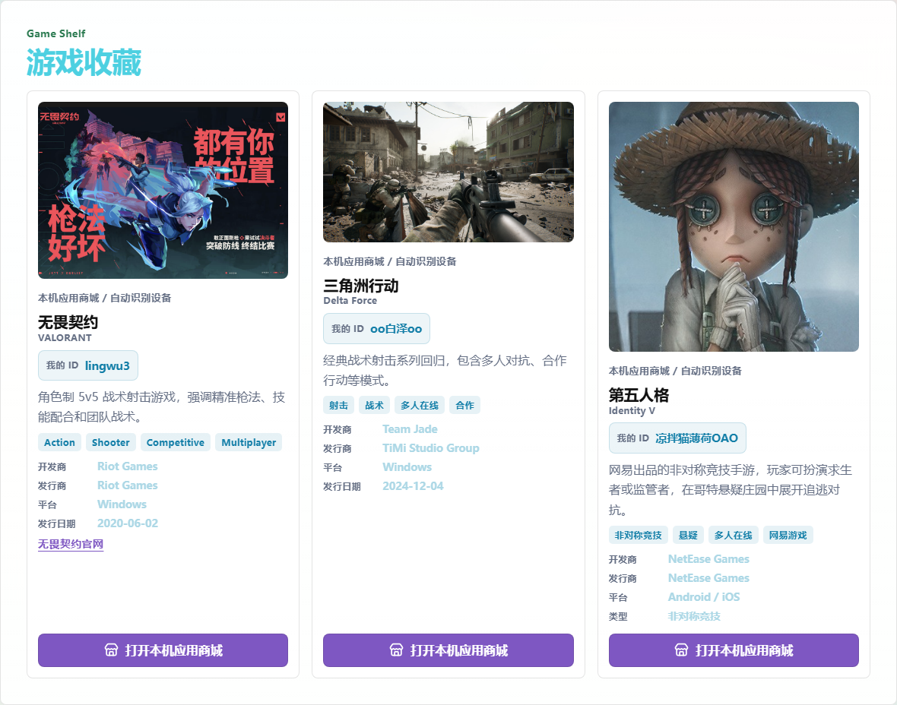
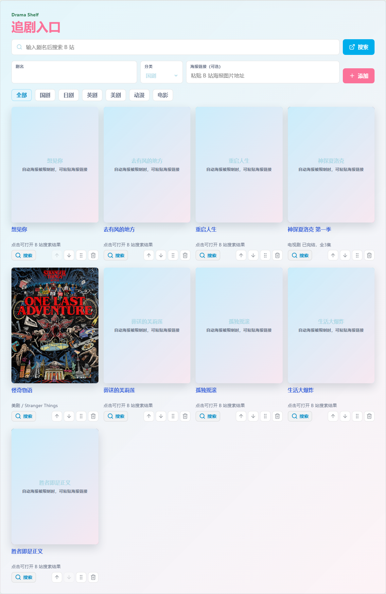
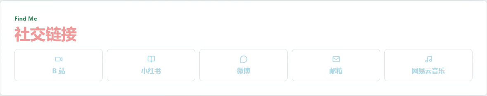

# Personal Homepage

一个把个人资料、游戏收藏、追剧管理和社交入口合在一起的静态个人主页。项目不依赖构建工具和后端服务，核心页面就是 `index.html`，样式与交互分别由 `styles.css` 和 `script.js` 维护。



## 功能导览

### 个人主页与头像设置

首页第一屏保留了个人主页的主视觉、顶部导航和快捷入口，可以直接跳转到游戏、追剧、社交三个板块。头像支持本地上传，并通过浏览器 `localStorage` 保存；也可以一键恢复默认头像。



### 游戏收藏

游戏板块展示了自己常玩的三款游戏，并把游戏海报、中文名、英文名、简介、标签、开发商/平台信息和个人游戏 ID 放在同一张卡片里：

- 无畏契约：`lingwu3`
- 三角洲行动：`oo白泽oo`
- 第五人格：`凉拌猫薄荷OAO`

每张卡片都带有“打开本机应用商城”按钮，会根据设备环境尝试唤起 Huawei、Android、Windows、iOS 的应用市场，并保留 Web fallback。



### 追剧入口

追剧板块既是剧集展示区，也是一个轻量的追剧管理器。它支持：

- 搜索 B 站：输入剧名后跳转到 Bilibili 搜索结果。
- 添加剧集：填写剧名、分类，也可以手动粘贴海报链接。
- 分类筛选：支持全部、国剧、日剧、英剧、美剧、动漫、电影。
- 海报展示：优先使用已有海报或手动海报；自动抓取失败时显示清晰的降级封面。
- 本地保存：剧集列表、海报预览和排序会保存在浏览器 `localStorage` 中，刷新后仍能保留。
- 排序管理：支持上移、下移、拖拽排序和删除剧集。
- 安全插入：动态内容会经过转义处理，避免把用户输入直接拼进页面。



### 社交链接

社交区集中放置常用入口：B 站、小红书、微博、邮箱和网易云音乐。外部链接会在新窗口打开，并保留 `rel="noreferrer"`。



## 设计细节

- 单页导航：顶部导航锚点对应 `#games`、`#dramas`、`#social`。
- 响应式布局：桌面端使用多列卡片，移动端自动收窄为单列阅读。
- 海报兜底：Bilibili 接口或外部图片失败时，页面仍会显示可读的剧集卡片。
- 动效降级：样式中包含 `prefers-reduced-motion` 处理，减少系统偏好低动效用户的动画负担。
- 静态部署：没有构建步骤，直接部署 HTML、CSS、JS 和 `assets/` 即可。

## 本地运行

建议在项目根目录通过本地 HTTP 服务预览，而不是只用 `file://` 打开：

```powershell
python -m http.server 8000
```

然后访问：

```text
http://localhost:8000/index.html
```

## 项目结构

```text
.
├── index.html          # 主页面，唯一事实入口
├── styles.css          # 首页、游戏、追剧、社交和响应式样式
├── script.js           # 头像、追剧、本地存储、B 站搜索、商店跳转等交互
├── assets/             # 自有头像、游戏图、剧集海报资源
├── docs/readme/        # README 使用的网站截图
├── games.html          # 旧链接兼容跳转到 index.html#games
└── dramas.html         # 旧链接兼容跳转到 index.html#dramas
```

## 外部依赖说明

页面会尝试访问 Lucide 图标 CDN、Bilibili 搜索/预览接口、外部海报图片和应用市场协议链接。这些资源可能因为网络、CORS 或客户端环境限制失败；当前实现保留了超时、错误捕获和可读的降级界面。

## 截图与验证

README 中的截图来自本地 HTTP 服务下的实际页面：

- 桌面视口：`1440px`
- 手机视口：`390px`
- 页面识别结果：3 个游戏卡片、9 个追剧卡片、5 个社交入口

验证时观察到 Bilibili 接口在本地 HTTP 下存在 CORS 限制，因此部分剧集会展示降级封面；这属于外部接口限制，页面本身没有阻断性崩溃。
